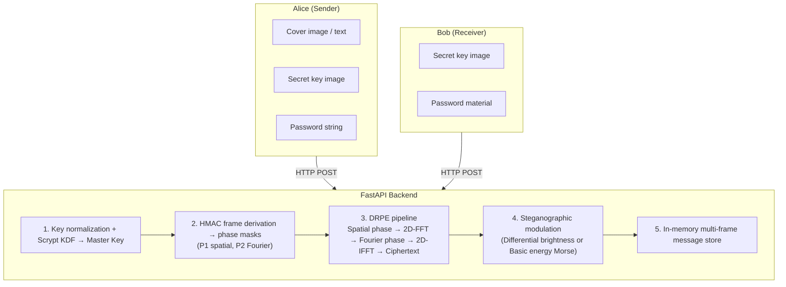

# 🛡️ Double Random Phase Encryption (DRPE) Optical Cryptosystem & Steganographic Transmission

An end-to-end optical cryptography and signal transmission system implementing classical **4-f Double Random Phase Encoding (DRPE)** in the Fourier domain. The platform features modern cryptographic key derivation (**Scrypt**, **HMAC-SHA256**), client-side image processing, and steganographic text transmission over multi-frame image sequences using **Morse code** with **differential brightness modulation** and side-channel energy analysis.

---

## Table of Contents

- [Overview & Architecture](#overview--architecture)
- [Theoretical & Mathematical Foundations](#theoretical--mathematical-foundations)
  - [4-f DRPE Optical Pipeline](#4-f-drpe-optical-pipeline)
  - [Parseval's Energy Invariance](#parsevals-energy-invariance)
  - [Cryptographic Key Derivation (KDF)](#cryptographic-key-derivation-kdf)
  - [Morse Code & Differential Modulation](#morse-code--differential-modulation)
  - [The Side-Channel Energy Vulnerability](#the-side-channel-energy-vulnerability)
- [System Features](#system-features)
  - [Backend Features](#backend-features)
  - [Frontend Features](#frontend-features)
- [Technology Stack](#technology-stack)
- [Project Directory Structure](#project-directory-structure)
- [Backend API Reference](#backend-api-reference)
- [Installation & Getting Started](#installation--getting-started)
  - [Prerequisites](#prerequisites)
  - [Backend Setup](#backend-setup)
  - [Frontend Setup](#frontend-setup)
- [Running Automated Tests](#running-automated-tests)
- [Security & Signal Processing Insights](#security--signal-processing-insights)

---

## Overview & Architecture

The repository simulates a physical 4-f optical encryption architecture combined with an Alice-and-Bob communications protocol.



---

## Theoretical & Mathematical Foundations

### 4-f DRPE Optical Pipeline

The core mathematical engine in `backend/services/drpe.py` models an optical 4-f Fourier transform processor.

**Encryption**

1. **Spatial plane modulation.** The 2D input image $f(x, y)$ is phase-modulated by an independent random phase mask $P_1(x, y) \in [0, 2\pi)$:

```math
s(x, y) = f(x, y) \cdot \exp\left(j \, P_1(x, y)\right)
```

2. **Optical Fourier transform (first lens).** The wave propagates to the frequency plane via a 2D Discrete Fourier Transform:

```math
G(u, v) = \mathcal{F}_{2D}\{s(x, y)\}
```

3. **Fourier plane modulation.** The spectrum is modulated by a second independent random phase mask $P_2(u, v) \in [0, 2\pi)$:

```math
G'(u, v) = G(u, v) \cdot \exp\left(j \, P_2(u, v)\right)
```

4. **Inverse Fourier transform (second lens).** The signal propagates to the output spatial plane:

```math
c(x, y) = \mathcal{F}_{2D}^{-1}\{G'(u, v)\}
```

The resulting complex array $c(x, y)$ is the stationary, white-noise-like ciphertext. The displayable preview is the amplitude $|c(x, y)|$.

**Decryption**

Decryption applies the exact conjugate phase masks $\exp(-j P_2)$ and $\exp(-j P_1)$ to the complex ciphertext $c(x, y)$:

```math
G'(u, v) = \mathcal{F}_{2D}\{c(x, y)\}
```

```math
G(u, v) = G'(u, v) \cdot \exp\left(-j \, P_2(u, v)\right)
```

```math
s(x, y) = \mathcal{F}_{2D}^{-1}\{G(u, v)\}
```

```math
f_{\text{recovered}}(x, y) = \mathrm{Re}\left(s(x, y) \cdot \exp\left(-j \, P_1(x, y)\right)\right)
```

### Parseval's Energy Invariance

By Parseval's theorem, unitary Fourier transforms preserve the total signal energy. Since phase masks have unit magnitude, the pipeline preserves energy end to end:

```math
\sum_{x, y} |f(x, y)|^2 = \sum_{x, y} |c(x, y)|^2
```

The system computes and verifies this invariant, where the energy of an image is:

```math
E = \sum_{i, j} \left(\mathrm{pixel}_{i, j}\right)^2
```

### Cryptographic Key Derivation (KDF)

Rather than relying on raw seeds or sequential offsets, the system uses a hardened key-derivation hierarchy (`backend/services/keys.py`):

- **Image canonicalization.** The uploaded key image is normalized into raw pixel bytes and hashed with `SHA-256` to produce a fixed 32-byte image digest.
- **Password KDF.** The password is expanded with a 16-byte random salt using `scrypt` ($N = 16384$, $r = 8$, $p = 1$, $\mathrm{dklen} = 32$).
- **Master key:**

```math
\mathrm{MasterKey} = \mathrm{SHA256}\left(\texttt{DRPE-MASTER-v1} \,\Vert\, \mathrm{PasswordKey} \,\Vert\, \mathrm{KeyImageDigest}\right)
```

- **Frame-index-bound mask generation.** Each frame $k$ derives independent, uncorrelated phase seeds via HMAC:

```math
\mathrm{Seed}_{P_1} = \mathrm{HMAC\text{-}SHA256}\left(\mathrm{MasterKey},\ \texttt{DRPE-v1} \,\Vert\, \texttt{DRPE/P1} \,\Vert\, \mathrm{MessageID} \,\Vert\, k\right)
```

```math
\mathrm{Seed}_{P_2} = \mathrm{HMAC\text{-}SHA256}\left(\mathrm{MasterKey},\ \texttt{DRPE-v1} \,\Vert\, \texttt{DRPE/P2} \,\Vert\, \mathrm{MessageID} \,\Vert\, k\right)
```

This ensures that compromising the seeds of frame $k$ does not reveal the seeds of frame $k+1$.

### Morse Code & Differential Modulation

Text transmission converts messages into international Morse code and assigns each character to a discrete symbol state:

| Symbol       | Value |    Morse     |
| :----------- | :---: | :----------: |
| `DOT`        |   0   |     `.`      |
| `DASH`       |   1   |     `-`      |
| `LETTER_GAP` |   2   | single space |
| `WORD_GAP`   |   3   |     `/`      |

#### Differential two-block-pair brightness modulation (secure)

To prevent energy leakage, `backend/services/encoding/symbol_image.py` implements a 4-block differential scheme using two block pairs:

- **Pair 1:** Block A at $(10, 10)$ and Block B at $(10, 50)$
- **Pair 2:** Block C at $(50, 10)$ and Block D at $(50, 50)$

Each symbol maps to a 2-bit sign pattern $(\mathrm{bit}_1, \mathrm{bit}_2)$ with a fixed delta $\Delta = 8$:

| Symbol           | Sign pattern | Pair 1 (A, B) | Pair 2 (C, D) |
| :--------------- | :----------: | :-----------: | :-----------: |
| `DOT` (0)        |   (+1, +1)   |   (+Δ, -Δ)    |   (+Δ, -Δ)    |
| `DASH` (1)       |   (+1, -1)   |   (+Δ, -Δ)    |   (-Δ, +Δ)    |
| `LETTER_GAP` (2) |   (-1, +1)   |   (-Δ, +Δ)    |   (+Δ, -Δ)    |
| `WORD_GAP` (3)   |   (-1, -1)   |   (-Δ, +Δ)    |   (-Δ, +Δ)    |

**Cancellation.** Every pair adds $+\Delta$ to one block and $-\Delta$ to the other, so the net brightness change is zero for every symbol:

```math
\Delta\mu = \sum \Delta\,\mathrm{pixel} = 0
```

The global mean brightness of the frame therefore stays constant across all symbols, which is intended to neutralize side-channel leakage through the frame's Parseval energy.

### The Side-Channel Energy Vulnerability

> [!WARNING] > **Educational demonstration.** The basic energy scheme below is intentionally insecure.

In `backend/services/basic_energy_service.py`, the system implements an uncancelled brightness modulation scheme:

```math
\mathrm{Offset} = \mathrm{symbol} \times 20.0 \qquad (\mathrm{symbol} \in \{0, 1, 2, 3\})
```

Because the offset is added without cancellation, the total frame energy increases monotonically:

```math
E(\mathrm{DOT}) < E(\mathrm{DASH}) < E(\mathrm{LETTER\_GAP}) < E(\mathrm{WORD\_GAP})
```

By Parseval's theorem this energy difference survives the DRPE transform. An observer can therefore **predict the Morse code and plaintext directly from the ciphertext amplitude, without decrypting and without the key image or password**, via `POST /api/text/basic-energy/predict`.

---

## System Features

### Backend Features

- **Pure functional optical engine** (`backend/services/drpe.py`): stateless, vectorized NumPy DRPE pipeline with 2D FFT/IFFT, phase mask rotation, and energy verification.
- **Process stages visualizer**: exports intermediate states:
  - Spatial input plane ($s$)
  - Shifted Fourier spectrum ($G$)
  - Frequency phase mask ($P_2$)
  - Modulated Fourier spectrum ($G'$)
  - Spatial ciphertext amplitude ($|c|$)
- **Dual text transmission schemes**:
  1. _Differential brightness encoding_: 2-bit differential cancellation intended to leak no energy.
  2. _Basic energy modulation_: demonstrator of Parseval energy leakage and side-channel classification.
- **Side-channel energy predictor** (`backend/services/basic_energy_service.py`): automatic decision-boundary calculation and threshold classification that recovers Morse code with no decryption.
- **Canonical key image processor** (`backend/services/image_utils.py`): deterministic key image reading, mode normalization (RGB/L), base64 serialization, and SHA-256 fingerprinting.
- **In-memory message registry** (`backend/services/messages.py`): concurrent, thread-safe store for multi-frame transmissions, complex NumPy arrays, and frame metadata.
- **Modular FastAPI design**: RESTful architecture separating routers, controllers, Pydantic validation schemas, and mathematical services.

### Frontend Features

- **Dynamic role-based interface** (`App.jsx`):
  - **Alice terminal** (`AlicePage.jsx`):
    - _Send Image_: upload cover image, key image, and password; view intermediate optical stages in real time.
    - _Send Text_: encrypt secret messages into differential Morse frames with live symbol breakdowns.
    - _Send Basic Energy_: transmit text with intentional energy signatures for side-channel testing.
  - **Bob terminal** (`BobPage.jsx`):
    - Automatic detection of transmitted message packets.
    - DRPE decryption: enter the matching key image and password to recover images or plaintext.
    - Interactive multi-frame stepper/carousel for Morse transmissions.
    - **"Extract Morse via Ciphertext Energy"**: one-click side-channel attack that extracts text directly from Parseval energy levels.
    - Diagnostic inspectors: per-frame differential metrics, brightness deltas, energy deviation plots, and decision thresholds.
  - **Supervisor DRPE laboratory** (`DRPEDemo.jsx`): standalone single-page testbed for side-by-side DRPE parameter exploration and Parseval energy verification.
- **Client-side image resizer** (`imageResizer.js`): HTML5 Canvas resizer supporting arbitrary aspect ratios and scaling of images larger than 2048 px without distortion.
- **Atmospheric visuals** (`NoiseReveal.jsx`): SVG-based procedural glass-shard noise reveal overlay with keyframe twinkle animations reflecting encryption and optical phase dispersion.

---

## Technology Stack

### Backend

| Technology                  | Version / Spec               | Purpose                                                 |
| :-------------------------- | :--------------------------- | :------------------------------------------------------ |
| **Python**                  | 3.9+ / 3.13                  | Core backend language                                   |
| **FastAPI**                 | Latest                       | High-performance asynchronous REST API framework        |
| **Uvicorn**                 | Standard                     | ASGI production web server                              |
| **NumPy**                   | Latest                       | FFT2, IFFT2, complex array manipulation, matrix math    |
| **Pillow (PIL)**            | Latest                       | Image decoding, canonicalization, and format conversion |
| **Pydantic**                | v2                           | Request/response validation and serialization           |
| **python-multipart**        | Latest                       | Multipart/form-data upload handling                     |
| **Standard library crypto** | `hashlib`, `hmac`, `secrets` | Scrypt KDF, HMAC-SHA256, secure salt generation         |
| **Pytest**                  | Latest                       | Unit and integration testing                            |

### Frontend

| Technology           | Version / Spec | Purpose                                                |
| :------------------- | :------------- | :----------------------------------------------------- |
| **React**            | 18.2.0         | Reactive UI library with hooks                         |
| **Vite**             | 5.0.0          | Frontend build tool and dev server                     |
| **Axios**            | 1.6.0          | HTTP client for the FastAPI endpoints                  |
| **HTML5 Canvas API** | Native         | Client-side proportional image resizing and thumbnails |
| **SVG / CSS3**       | Custom         | Shard-based procedural noise overlay and dark theme    |

---

## Project Directory Structure

```text
Encryption-System/
├── README.md                          # Project documentation
├── Text-Encryption.md                 # Specification for Phase 2 Morse transmission
├── backend/
│   ├── main.py                        # FastAPI entrypoint and CORS configuration
│   ├── config.py                      # Single source of truth for coordinates and constants
│   ├── requirements.txt               # Python dependency manifest
│   ├── routers/
│   │   ├── image_router.py            # Phase 1 image encryption/decryption routes
│   │   └── text_router.py             # Phase 2 differential and basic energy text routes
│   ├── controllers/
│   │   ├── image_controller.py        # Request handling for image operations
│   │   └── text_controller.py         # Request handling for text operations
│   ├── schemas/
│   │   └── image_schema.py            # Pydantic request/response models
│   ├── services/
│   │   ├── drpe.py                    # Pure 4-f optical DRPE encryption/decryption math
│   │   ├── keys.py                    # Scrypt KDF and HMAC-SHA256 per-frame key derivation
│   │   ├── image_utils.py             # Image canonicalization and base64 conversions
│   │   ├── messages.py                # In-memory registry for multi-frame packets
│   │   ├── basic_energy_service.py    # Basic Morse encryption and side-channel prediction
│   │   ├── text_encryption.py         # Differential brightness text encryption
│   │   ├── text_decryption.py         # Differential brightness text decryption
│   │   └── encoding/
│   │       ├── text_to_morse.py               # Text to ITU Morse converter
│   │       ├── morse_to_text.py               # ITU Morse to plaintext converter
│   │       ├── morse_to_symbol_sequence.py    # Morse to 4-state symbol mapper
│   │       ├── symbol_image.py                # 4-block differential brightness image generator
│   │       └── basic_energy_morse.py          # Single-block energy modulation generator
│   └── tests/
│       ├── test_drpe.py                       # DRPE math and roundtrip fidelity
│       ├── test_phase2_decryption.py          # End-to-end differential text transmission
│       └── test_basic_energy_morse.py         # Energy separation and side-channel extraction
└── frontend/
    ├── package.json                   # Frontend dependency manifest
    ├── vite.config.js                 # Vite configuration
    ├── index.html                     # Single-page application root
    └── src/
        ├── main.jsx                   # React DOM entrypoint
        ├── App.jsx                    # Main component and role router (Alice/Bob)
        ├── api.js                     # Axios client configured for the backend baseURL
        ├── pages/
        │   ├── AlicePage.jsx          # Sender interface (Image, Text, Basic Energy)
        │   ├── BobPage.jsx            # Receiver interface (DRPE decrypt, energy predictor)
        │   └── DRPEDemo.jsx           # Supervisor laboratory for standalone DRPE evaluation
        ├── components/
        │   ├── NoiseReveal.jsx        # Animated SVG glass-shard optical overlay
        │   └── drpe/
        │       └── ImagePanel.jsx     # Reusable image preview component
        └── utils/
            └── imageResizer.js        # Client-side canvas image processor
```

---

## Backend API Reference

### General

#### `GET /api/health`

- **Returns:** `{"status": "ok"}`
- **Purpose:** system health and liveness check.

### Phase 1: Image Encryption & Decryption

#### `POST /api/encrypt`

- **Payload (`multipart/form-data`):**
  - `cover_image`: original image file (JPEG/PNG).
  - `secret_key_image`: key image file for mask derivation.
  - `secret_password`: password string.
  - `message_id`: _(optional)_ unique transmission identifier.
  - `frame_index`: _(optional, default `0`)_.
- **Returns:** `EncryptResponse` (display magnitude image, Parseval cover and ciphertext energies, `message_id`, salt, and intermediate stages).

#### `POST /api/decrypt-with-key-images`

- **Payload (`multipart/form-data`):**
  - `message_id`: ID of the stored transmission.
  - `secret_key_image`: receiver's key image.
  - `secret_password`: receiver's password.
  - `frame_index`: _(optional, default `0`)_.
- **Returns:** `DecryptResponse` (recovered image base64, energy, `match_with_cover` boolean, and intermediate decryption stages).

### Phase 2: Differential Brightness Text Transmission (Secure)

#### `POST /api/text/encrypt`

- **Payload (`multipart/form-data`):**
  - `secret_text`: plaintext message to encrypt.
  - `base_image`: base RGB carrier image.
  - `secret_key_image`: key image file.
  - `secret_password`: password string.
- **Returns:** `TextEncryptResponse` (`message_id`, `morse`, `symbols`, `frame_count`, `previews`).

#### `POST /api/text/decrypt`

- **Payload (`multipart/form-data`):**
  - `message_id`: ID of the stored text packet.
  - `secret_key_image`: Bob's key image.
  - `secret_password`: Bob's password.
- **Returns:** `TextDecryptResponse` (`text`, `morse`, `symbols`, `success`, `frames` diagnostics).

### Phase 2: Basic Energy Text Transmission & Side-Channel Analysis

#### `POST /api/text/basic-energy/encrypt`

- **Payload (`multipart/form-data`):**
  - `secret_text`: plaintext string.
  - `base_image`: base image file.
  - `secret_key_image`: key image file.
  - `secret_password`: password string.
- **Returns:** `BasicEnergyEncryptResponse` (`thresholds`, `energy_levels`, `previews`, `symbols`).

#### `POST /api/text/basic-energy/decrypt`

- **Payload (`multipart/form-data`):**
  - `message_id`: ID of the message.
  - `secret_key_image`: key image file.
  - `secret_password`: password string.
- **Returns:** `BasicEnergyDecryptResponse` (normal DRPE decryption of basic energy frames).

#### `POST /api/text/basic-energy/predict`

- **Payload (`multipart/form-data`):**
  - `message_id`: ID of the message.
- **Returns:** `BasicEnergyPredictResponse` (**zero-decryption** recovery containing `predicted_text`, `predicted_morse`, `frame_energies`, and `thresholds`).

---

## Installation & Getting Started

### Prerequisites

- **Python** 3.9 or higher (tested up to 3.13)
- **Node.js** 18.x or higher
- **npm** 9.x or higher

### Backend Setup

**1. Navigate to the backend directory**

```bash
cd backend
```

**2. Create and activate a virtual environment**

macOS / Linux:

```bash
python3 -m venv venv
source venv/bin/activate
```

Windows:

```cmd
python -m venv venv
venv\Scripts\activate
```

**3. Install dependencies**

```bash
pip install -r requirements.txt
```

**4. Launch the FastAPI application**

```bash
uvicorn main:app --reload --port 8000
```

The backend will be live at `http://127.0.0.1:8000`, with interactive API docs at `http://127.0.0.1:8000/docs`.

### Frontend Setup

**1. Open a new terminal and navigate to the frontend directory**

```bash
cd frontend
```

**2. Install Node dependencies**

```bash
npm install
```

**3. Start the Vite development server**

```bash
npm run dev
```

Open your browser at `http://localhost:5173`.

---

## Running Automated Tests

The backend test suite covers mathematical accuracy, roundtrip fidelity, key-derivation uniqueness, and side-channel classification:

```bash
cd backend

# Run all tests
pytest -v

# Run individual test modules
pytest tests/test_drpe.py -v
pytest tests/test_phase2_decryption.py -v
pytest tests/test_basic_energy_morse.py -v
```

### Key assertions tested

- **Roundtrip precision:** max error $< 10^{-15}$ when decrypting with the identical dual keys.
- **Wrong or partial key rejection:** decryption with an incorrect $P_1$ or $P_2$ yields unrecognizable noise (error $> 10.0$).
- **Parseval energy conservation:** invariance of total energy across spatial and Fourier transformations.
- **Side-channel separation:** strictly increasing $E(\mathrm{DOT}) < E(\mathrm{DASH}) < E(\mathrm{LETTER\_GAP}) < E(\mathrm{WORD\_GAP})$.
- **Zero-decryption prediction:** accurate Morse and text extraction directly from ciphertext energy.

---

## Security & Signal Processing Insights

1. **Why naive sequential seeds failed.** Earlier designs used linear seed sequences ($S_k = S_0 + k$), so recovering one frame's key compromised all subsequent frames. The current architecture replaces this with **HMAC-SHA256 frame-index binding**, so knowing one frame's seeds does not reveal the others.
2. **Why energy cancellation matters in steganography.** Modulating intensity without differential cancellation creates an energy fingerprint that survives Fourier-domain phase scrambling because of Parseval's theorem. The **4-block differential technique** pairs every block receiving $+\Delta$ with a counterpart receiving $-\Delta$, so the frame's mean brightness stays constant across symbols and the simple energy-threshold attack no longer applies.
